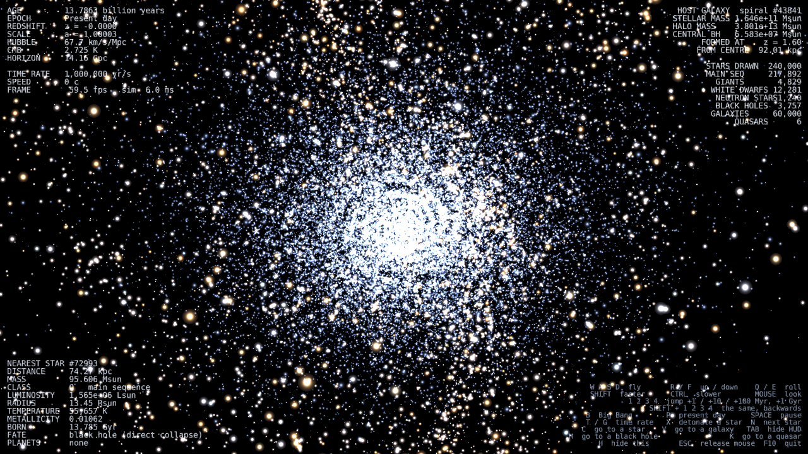
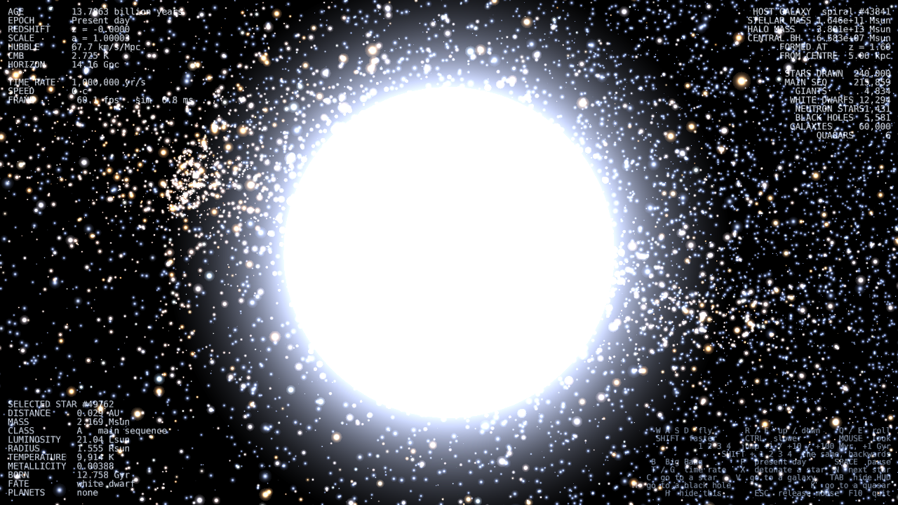
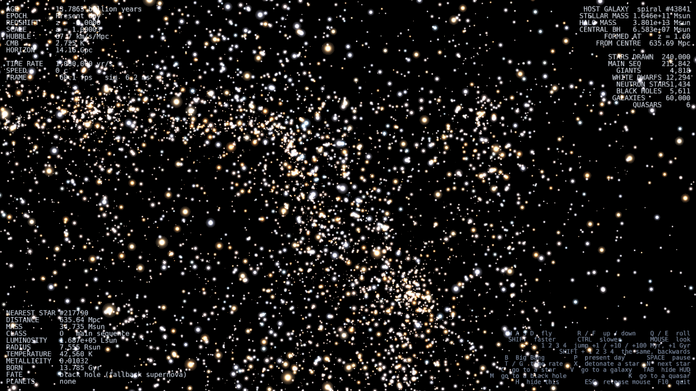
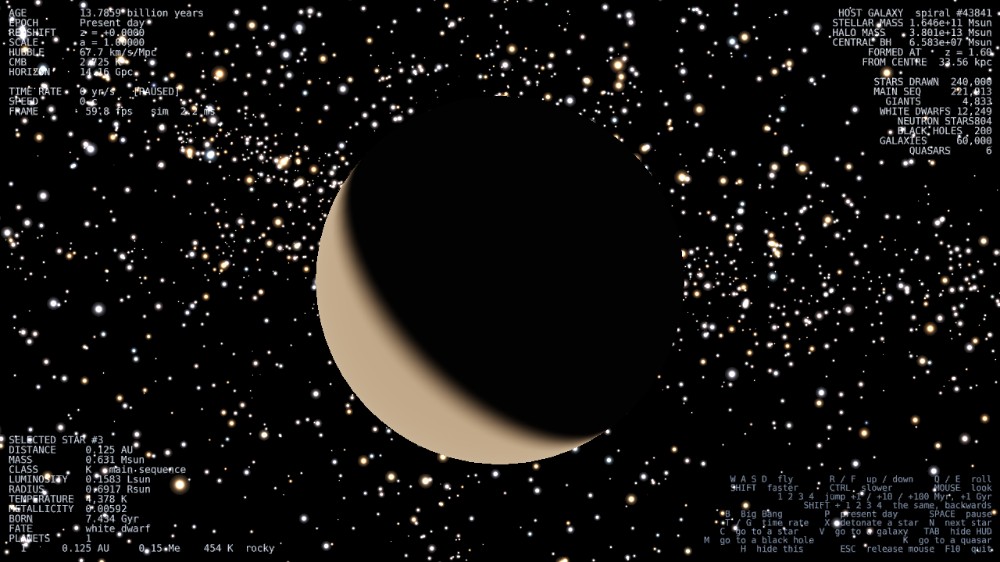
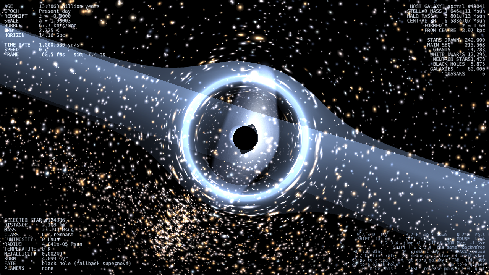

<<<<<<< HEAD
**This is a Python-based universe simulator**
1. You can witness supernovae, black holes, planets, using a simulated physics engine designed to replicate our knowledge of real-world physics.
2. You can travel millions of miles in a couple of seconds.
3. Optimized for CPU, GPU acceleration *may* be added.
4. Have fun with it

**Setup guide:**

bash '''
git clone https://github.com/Codalorian/Python-Universe-Simulator
cd Python-Universe-Simulator
pip3 install ursina numpy
python3 main.py
'''
=======
# Universe Simulator

A to-scale, physically grounded model of the universe — from the Big Bang to a
billion years beyond the present day — that you fly around in real time.

240,000 individually evolving stars and 60,000 galaxies at a locked 60 fps.



Nothing here is a texture or a fitted curve. Star colours are the CIE colours of
their Planck spectra, the expansion history is a numerical integration of the
Friedmann equation, and a black hole's shadow, accretion disc and jets all follow
from its mass, spin and accretion rate.

---

## Running it

```bash
pip install ursina numpy
python3 main.py
```

Tested on Python 3.12, Ursina 8.3, NumPy 1.26, Panda3D with OpenGL 3.2+.
Runs at 60 fps on integrated graphics (Intel Iris Xe).

---

## Controls

| | |
|---|---|
| `W A S D` | fly · `R` / `F` up and down · `Q` / `E` roll |
| `SHIFT` / `CTRL` | faster (×10) / finer (×0.08) |
| mouse | look · `ESC` releases the cursor |
| `1` `2` `3` `4` | jump +1 / +10 / +100 Myr, +1 Gyr (`SHIFT` to go back) |
| `B` / `P` | Big Bang / present day |
| `SPACE` | pause · `T` / `G` time rate up and down |
| `X` | detonate the nearest massive star |
| `N` | cycle nearby luminous stars · `C` travel to the selected one |
| `V` | travel to another galaxy |
| `M` / `K` | travel to a black hole / an active quasar |
| `TAB` / `H` | hide the HUD / the control list · `F10` quit |

Travel speed scales with the distance to the nearest object, so the same key
crosses a planetary system and intergalactic space. Star to star is about eight
seconds with `SHIFT` held.

---

## What is actually simulated

### Cosmology

The Friedmann equation is integrated numerically at import, building a table
that links scale factor, cosmic time, redshift, comoving distance and lookback
time. Everything downstream is a lookup.

| quantity | this model | published |
|---|---|---|
| Age of the universe | 13.786 Gyr | 13.787 |
| Particle horizon | 14.16 Gpc | ~14.2 |
| Deceleration parameter q₀ | −0.533 | −0.53 |
| Growth factor D(z=1) | 0.609 | ~0.61 |
| Recession velocity at 100 Mpc | 6,766 km/s | ~6,770 |

Also modelled: the thermal history from the Planck epoch through
nucleosynthesis, recombination and reionisation; the CMB temperature as
2.7255 K / a(t); and the primordial fireball, which really does fill the sky
before the universe turns transparent.

### Stars

Sampled from the Kroupa initial mass function with formation times following the
Madau–Dickinson cosmic star formation history, which peaks at z ≈ 1.9.

Main-sequence lifetimes come from the nuclear timescale — available core mass
times 0.7% of *mc*² divided by luminosity — not from a fitted exponent.
Temperature is the Stefan–Boltzmann inversion of luminosity and radius, so L, R
and T stay mutually consistent when a star swells into a giant.

| mass | lifetime here | published |
|---|---|---|
| 1 M☉ | 10.2 Gyr | ~10 |
| 2 M☉ | 1.47 Gyr | ~1.2 |
| 25 M☉ | 5.9 Myr | ~6.4 |
| 40 M☉ | 3.7 Myr | ~4.3 |

Colour is the CIE tristimulus integral of the star's Planck spectrum over
360–830 nm, using the Wyman–Sloan–Shirley colour matching fits, converted to
sRGB and gamut-mapped. The Sun comes out very slightly warm white; M dwarfs
orange; O stars blue-white.



How blinding a resolved star looks is set by its temperature alone. Surface
brightness is σT⁴ and, unlike flux, does not fall off with distance — only
angular size does — so one expression covers a 2,500 K red dwarf and a
40,000 K O star. The disc is limb-darkened by I(μ)/I(0) = 1 − 0.62(1 − μ), and
the glare around it grows with the logarithm of the apparent flux, the same law
the distant star field uses, so a star looks continuous as it crosses from a
point sprite to a resolved disc.

Remnants follow the Kalirai initial–final mass relation for white dwarfs
(cooling by Mestel's law), the TOV limit for neutron stars, and fallback or
direct collapse for black holes.

### Supernovae

Types Ia, II and Ib/c, hypernovae and pair-instability explosions, classified by
progenitor mass and metallicity. Light curves are powered by the actual
⁵⁶Ni → ⁵⁶Co → ⁵⁶Fe decay chain, with the right half-lives and specific decay
powers, plus a hydrogen recombination plateau for Type II and shock breakout for
core collapse.

| type | peak M_bol here | observed |
|---|---|---|
| Ia | −19.0 | −19.3 |
| II | −16.1 | −17.0 |
| Pair-instability | −21.7 | −21.5 |

Press `X` and the nearest star massive enough for core collapse will oblige. A
red dwarf will not, however hard you ask.

### Galaxies

Drawn from a cold dark matter halo mass function, with stellar masses from
Moster abundance matching, sizes from the observed size–mass relations, and
central black holes from the Magorrian relation. Positions trace a cosmic web of
filaments, sheets and voids.



The morphology mix lands where a deep survey does: 71% spiral, 12% elliptical,
13% irregular, 5% lenticular. A Milky Way–mass halo gets r_vir = 211 kpc,
σ = 101 km/s, M★ = 3.4 × 10¹⁰ M☉; a 10¹⁵ M☉ cluster gets σ = 1,010 km/s.

Mergers fire at the observed rate, which rises as (1+z)^2.5, and a major merger
destroys the disc.

### Planetary systems

Built by core accretion: a minimum-mass-solar-nebula disc, a snow line at
2.7 √L AU, and isolation masses that only exceed the ~10 Earth-mass threshold
for gas capture beyond the ice line. Giant planet occurrence rises with host
metallicity, as it does in the real exoplanet census.

Orbits are exact. Kepler's equation is solved by Newton iteration, and the
relativistic perihelion precession comes out at **42.98 arcsec/century** for
Mercury's parameters.



Planets are lit by their own star, so a world on the far side of its orbit shows
as a crescent.

### Black holes and quasars



- **Shadow** at √27 GM/c² — what a distant observer sees, not the Schwarzschild
  radius.
- **Accretion disc** coloured by the Shakura–Sunyaev temperature profile, which
  peaks at 1.36 r_isco, with Keplerian velocities and relativistic Doppler
  beaming as the Doppler factor cubed.
- **Jets** powered by Blandford–Znajek, length scaling as P^⅓ (≈3 kpc at
  10³⁸ W), collimated within ~12 gravitational radii then opening at ~1.3°.
- **Gravitational lensing** of everything behind, using the exact Schwarzschild
  point-lens equation β = θ − θ_E²/θ, with the true magnification
  μ = 1/|1 − (θ_E/θ)⁴|. The far side of the disc is lifted up over the top of
  the hole, and a faint secondary image of its underside hugs the shadow.

Quasar activity follows a duty cycle peaking at cosmic noon: ~150 active nuclei
at z = 2, five today. A few per cent of stellar-mass black holes are accreting
X-ray binaries. Sanity checks: radiative efficiency 0.057 at a = 0 and 0.32 at
a = 0.998; Salpeter time 50 Myr; an equal-mass merger leaves spin 0.686 and
radiates 5% of the mass. The Crab pulsar's spin-down reproduces to within 1%.

---

## How it runs at 60 fps

Three ideas do most of the work.

**State is a function of cosmic time, not an accumulation.** A star's phase
follows from comparing *t* − *t_formation* against two fixed timescales. Nothing
integrates, so time travel is exact in both directions, there is no drift, and
jumping a billion years costs the same as advancing one frame.

**Almost nothing changes between frames.** Every transition a star will ever make
is precomputed into one sorted event schedule. Stepping forward is a binary
search plus a walk over the few thousand stars that actually crossed a
threshold — not a pass over the population. A rolling slice keeps slowly cooling
remnants current, and a full O(N) evaluation handles jumps and running backwards.

**Nothing is a scene graph node.** Each population is a single interleaved GPU
vertex buffer drawn as one point primitive. The logarithmic distance compression
happens in the vertex shader against a camera-position uniform, so crossing the
universe uploads nothing — it is three floats.

Heavy work (rebuilding a galaxy's stars, redrawing the short-lived stellar
population) runs on worker threads, planned for where the clock *will be* when
it lands. Anything paced by simulated time is also rate-limited in real time: at
a trillion years a second, 300 Myr elapses in a third of a millisecond.

### Measured

On an Intel Iris Xe at 1600×900:

| | mean | frames under 16.7 ms |
|---|---|---|
| Default view | 122 fps | 99.1% |
| Black hole, with lensing | 107 fps | 98.1% |
| With vsync (normal play) | 60.1 fps | locked |

Resident memory settles at ~290 MB and stays flat under sustained travel.

### The distance compression

There is no linear scale on which both a planet and a galaxy are visible, so
every deep-space position is compressed logarithmically about the camera:

```
r_render = log10(1 + r / 1000 km) × 7
```

That puts a fifty-metre approach and the edge of the observable universe inside
143 render units. The compression preserves *direction* exactly and changes only
range, so angular sizes are restored explicitly — a body of radius R at distance
d is drawn with radius p·R/d at compressed distance p, which subtends exactly
the angle it should.

---

## Command line

| flag | |
|---|---|
| `--stars N` `--galaxies N` | population sizes (default 240,000 / 60,000) |
| `--seed N` | random seed |
| `--view V` | start at `disc`, `galaxy`, `cosmic`, `system`, `star`, `planet`, `blackhole` or `quasar` |
| `--standoff N` | viewing distance: stellar radii for `star`, gravitational radii for black holes |
| `--age GYR` | start at a cosmic age (0 is the Big Bang) |
| `--windowed WxH` | window size |
| `--benchmark N` | fly a fixed path, report frame times with a CPU breakdown, exit |
| `--stress SECONDS` | fly flat out logging memory, threads and frame time |
| `--selftest` | press every control in turn and report failures |
| `--screenshot PATH` | render a few frames, save an image, exit |
| `--memory-limit MB` | abort if resident memory runs away (default 3072, `0` disables) |
| `--no-vsync` | uncap the frame rate |

Examples:

```bash
python3 main.py --view quasar --age 3.3        # a quasar at cosmic noon
python3 main.py --view star --standoff 3       # three stellar radii from a star
python3 main.py --age 0.0003                   # inside the primordial fireball
python3 main.py --benchmark 600 --no-vsync     # measure it
```

---

## Layout

```
main.py                      Ursina application: flight, HUD, input, viewpoints
simulation_kernel.py         The clock, the observer, and everything they see
simulation_constants.py      Physical constants and simulation sizes

cosmology/
  expansion/                 Friedmann integration, distances, growth factor
  cosmictime/                The clock
  hubbleflow/                Proper distances, recession, redshift
  bigbang/                   Thermal history and epochs
stellar_pop/
  stellar_evolution/         Structure relations, blackbody colour,
                             the vectorised population, a scalar Star
  star_birth/                Kroupa IMF, cosmic SFR, enrichment
  remnants/                  White dwarfs, neutron stars, black holes
  supernovae/                Classification, energetics, light curves
galaxy_pop/
  dark_matter_halos/         NFW haloes, abundance matching
  galaxy_formation/          Catalogue, morphologies, cosmic web
  mergers/                   Merger rates and dynamical friction
compact_objects/
  black_holes/               Horizons, ISCO, M–sigma, growth
  neutron_stars/             Pulsar spin-down, magnetars
  quasars/                   Eddington accretion, disc profile, jets
planetary_systems/
  formation/                 Core accretion, planet types
  orbital_mechanics/         Kepler solver, Hill radii, GR precession
  collisions/                Stability and giant impacts
renderer/
  __init__.py                Distance compression, GPU point cloud
  shaders.py                 Star, planet, disc, jet, shadow shaders
  geometry.py                Procedural spheres, annuli, jets
  star_field/ galaxy_lod/    The two big point batches
  nearby_objects/            Resolvable bodies, drawn as geometry
  black_holes.py             Shadow, accretion disc, jets
  lensing.py                 Screen-space gravitational lensing
```

About 12,000 lines.

---

## Known limitations

These are real and worth knowing before you go looking for them.

**Stars are ~400× too far apart.** 240,000 rendered stars stand in for roughly
10¹¹, so the median spacing between neighbours is 220 pc rather than a few light
years. Raising `--stars` barely helps, since spacing falls only as N^(−1/3). The
fix is a dense local shell at true stellar density around the observer, which
is not built yet.

**The population is deliberately over-sampled at the bright end.** Drawn purely
from the IMF, a quarter of a million stars would contain no living massive stars
at all and nothing could ever explode. The population is therefore a mixture —
a true-IMF field component plus a young component uniform in log mass — and
every star carries an importance weight so that weighted counts still reproduce
the real galaxy. What is over-sampled is exactly what a telescope over-samples.

**The accretion disc has a faceted dark boundary near the shadow.** The dark
annulus itself is correct — the primary lensed image cannot appear inside the
Einstein radius — but its edge is polygonal, because the deflection is evaluated
per vertex and the Einstein radius varies steeply across the inner disc. The fix
is to solve the lens equation per *fragment* against an analytic disc plane
rather than per vertex.

**Close planetary viewing needs the clock stopped.** Four planetary radii from a
world, that world is moving tens of km/s along its orbit, so at any rate fast
enough to watch the orbit it leaves the frame. `--view planet` pauses
automatically. The proper fix is a co-moving reference frame.

**Jets are not lensed geometrically** — only by the screen-space pass.

---

## Verifying it yourself

The three diagnostic modes are not decoration; they were written because each
one caught a real bug.

```bash
python3 main.py --selftest              # exercises all 25 controls
python3 main.py --stress 45             # watches memory, threads, frame time
python3 main.py --benchmark 600 --no-vsync
```

`--stress` found a leak that grew to 17 GB in 30 seconds and took a machine
down with it — Panda3D copy-on-writes an entire vertex buffer if you call
`modify_vertex_data()` inside the render loop, which does not reproduce outside
one. The memory guard exists so that class of mistake can never again reach the
point of locking up a desktop.
>>>>>>> 4ec6b82 (add readme and other functions)
